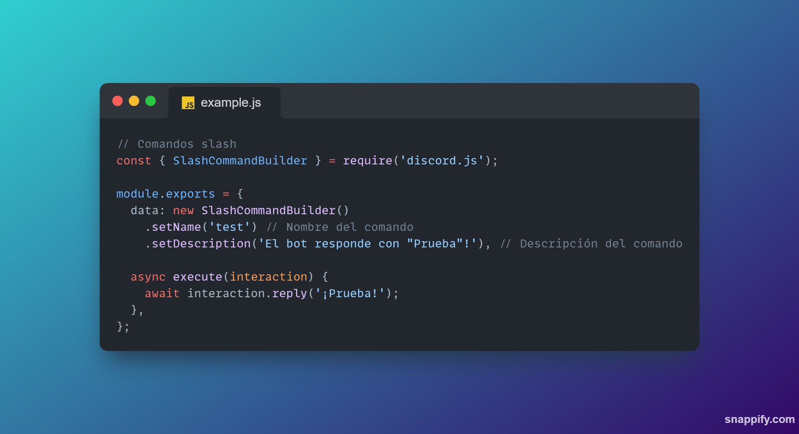
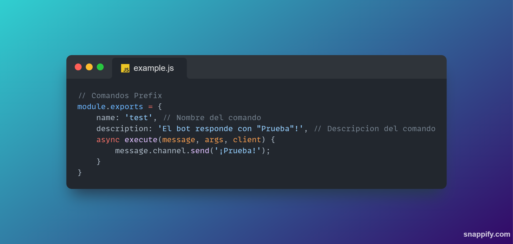

# Bienvenido a Cat Orange! 🐈

Este proyecto es para ayudar a las personas que quieren tener un bot de discord con el codigo ya hecho con funciones en casi todas las areas!

# 🚦 Que tiene el bot?

Handlers y Funcionalidades

### 📑 [CommandHandler](https://github.com/Gabo2447/discord_js/tree/main/handlers/commandHandler.js)
CommandHandler organizado y con su propia sección
  
### 📄[PrefixHandler](https://github.com/Gabo2447/discord_js/tree/main/handlers/prefixHandler.js)
PrefixHandler organizado y separado del CommandHandler.

### 📑[Registrador de comandos](https://github.com/Gabo2447/discord_js/tree/main/index.js")
Index organizado, fácil de leer y solamente con cosas necesarias.

### ⁉️ Próximamente más funciones
Trabajando en optimizar y mejorar el bot.

# 📝 **Customizar el bot**

Si quieres agregar mas comandos o funcionalidades basate de las siguientes plantillas para [**comandos prefijos**](https://github.com/Gabo2447/discord_js/edit/main/README.md#-slashcommands) y [**comandos slash**](https://github.com/Gabo2447/discord_js/edit/main/README.md#-prefixcommands):
>  [!IMPORTANT]
> Cuidado con los comandos slash y los comandos prefijos, no utilizan la misma manera para enviar mensajes.

## 📑 SLASHCOMMANDS

## 📄 PREFIXCOMMANDS
